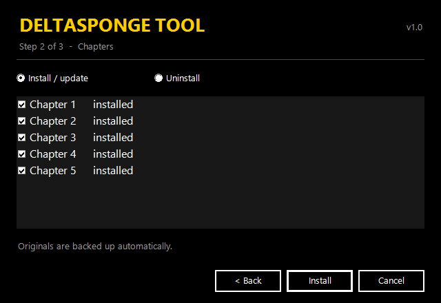

<div align="center">

# DeltaSponge Tool

**An in-game cheat menu for DELTARUNE** — by yutsu
Fight any boss, edit your party, give yourself items, and toggle god mode — all from one menu.

**[⬇ Download the latest release](../../releases/latest)**



</div>

---

## Features

| Tab | What you can do |
|---|---|
| **BATTLES** | Every battle in the chapter, with a **BOSSES** filter. Click one to fight it right away — with the boss's own music. |
| **PARTY** | Swap Kris / Susie / Ralsei / Noelle, edit HP, ATK, DEF, MAG, heal, gold, TP. |
| **ITEMS** | Add any item, weapon or armor. Click your inventory to remove things. |
| **CHEATS** | God mode · One-hit kill · 1 HP mode · Auto spare · Infinite TP |
| **OPTIONS** | Rebind the menu key, pause the game while the menu is open, show active cheats. |

Works with **Chapters 1–5** of the Steam version.

## Install

1. Download **`DeltaSponge-Setup.exe`** from the [latest release](../../releases/latest).
2. Close DELTARUNE, then run the setup.
3. Click **Next** → **Next** → **Install**.

The setup finds your game automatically, backs up the original files, and patches each chapter.
The first time, it downloads the official [UndertaleModTool](https://github.com/UnderminersTeam/UndertaleModTool) command-line tool (~60 MB), which does the patching.

> **Windows SmartScreen** may warn you because the setup is not signed. Click **More info → Run anyway**.

## Controls

| Key | Action |
|---|---|
| `` ` `` (the key under Esc — `²` on AZERTY) | Open / close the menu |
| `F9` | Open / close the menu (always works) |
| `Esc` | Close the menu |
| Mouse | Everything else |

To start a battle you need to be in the **Dark World**, with Kris free to move (no cutscene, no game menu open).

## Uninstall

Run the setup again, choose **Uninstall**, and click **Uninstall**.
You can also use Steam: **Properties → Installed Files → Verify integrity of game files**.

## After a game update

Steam updates replace the game files and remove the mod. Just run the setup again.

## Manual install (advanced)

Without the setup, using the [UndertaleModTool](https://github.com/UnderminersTeam/UndertaleModTool/releases) app:

1. **File → Open** `DELTARUNE\chapterX_windows\data.win`
2. **Scripts → Run other script…** → `mod/DeltaSponge_Install.csx` (keep the `gml` folder next to it)
3. **File → Save**
4. Repeat for each chapter.

Silent install from a terminal:

```
DeltaSponge-Setup.exe --install [--path "C:\...\DELTARUNE"] [--chapters 1,2,5]
DeltaSponge-Setup.exe --uninstall
```

## Troubleshooting

| Problem | Fix |
|---|---|
| The menu doesn't open | Run the setup again (a game update may have removed it). Try `F9`. |
| "Access denied" during setup | Right-click the setup → **Run as administrator**. |
| A battle won't start | Load a save, go to the Dark World, close the game's menu. |
| A story boss acts weird | Some bosses depend on their cutscene. Save before experimenting. |

## Build from source

Only Windows is needed (it uses the C# compiler that ships with .NET Framework 4):

```
setup\build.bat
```

Output goes to `dist/`. Pushing a tag like `v1.0` builds and publishes a release automatically (GitHub Actions).

```
mod/
  DeltaSponge_Install.csx   UndertaleModTool script that injects the mod
  gml/                      The menu itself (GameMaker Language)
setup/
  Setup.cs                  Setup wizard
  build.bat                 Builds the setup and the release zip
  app.manifest              Windows manifest (no admin prompt)
docs/                       Images for this README
```

## How it works

The setup adds one persistent object, `obj_deltasponge`, to each chapter's `data.win`. It reads the game's own
data at runtime (battle list, item names, party stats), so it adapts to each chapter. Battles are started with the
same functions the game itself uses. Boss battles get the same song their story cutscene would play
(Jevil, King, Queen, Spamton NEO, Knight, Tenna, Titan…).

## Credits

- **yutsu** — author.
- **claude** — debug.
- **Ninsmash** — tester.
- [UndertaleModTool](https://github.com/UnderminersTeam/UndertaleModTool) (GPL-3.0) — used to patch the game. Not bundled; downloaded from its official release page.
- DELTARUNE © Toby Fox. This is a fan-made mod, not affiliated with Toby Fox or 8-4. No game files are included.

## License

[MIT](LICENSE)
